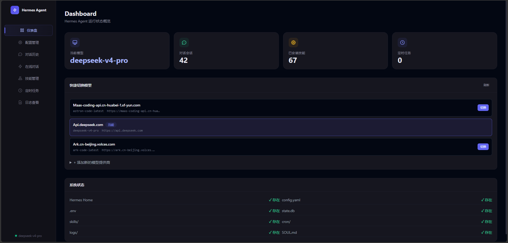
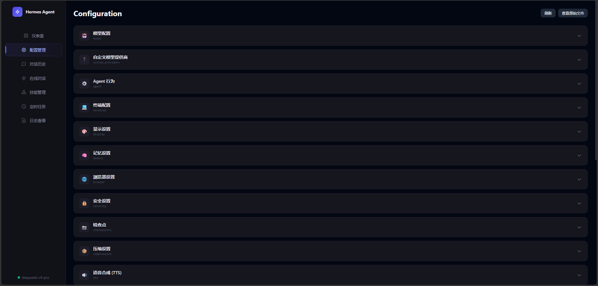
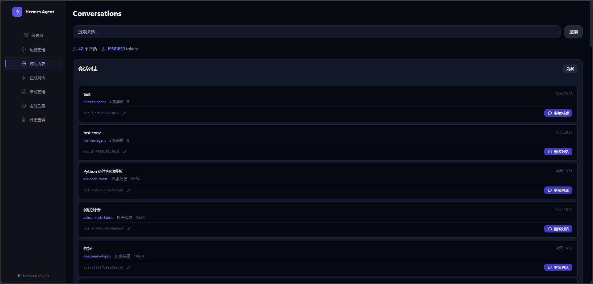
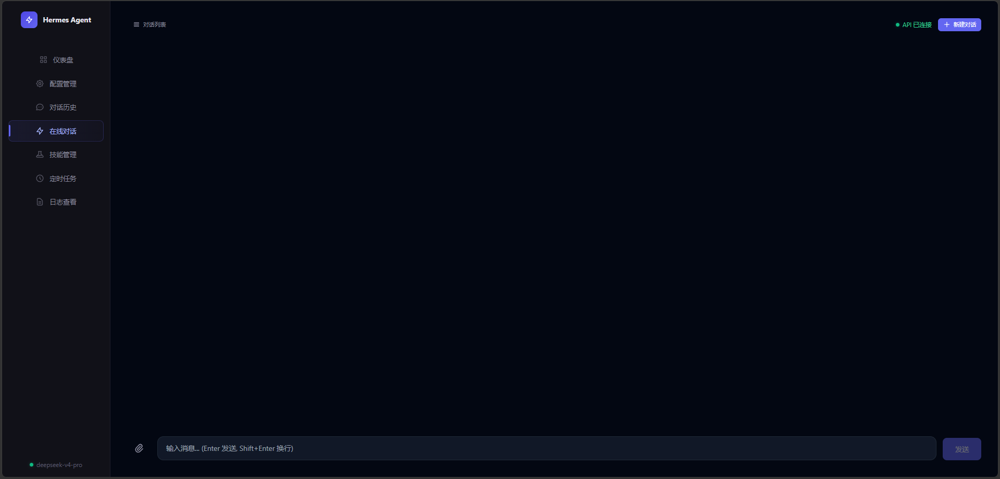
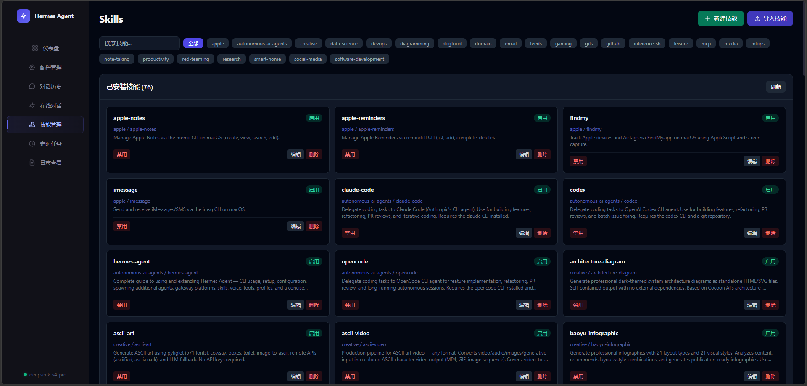
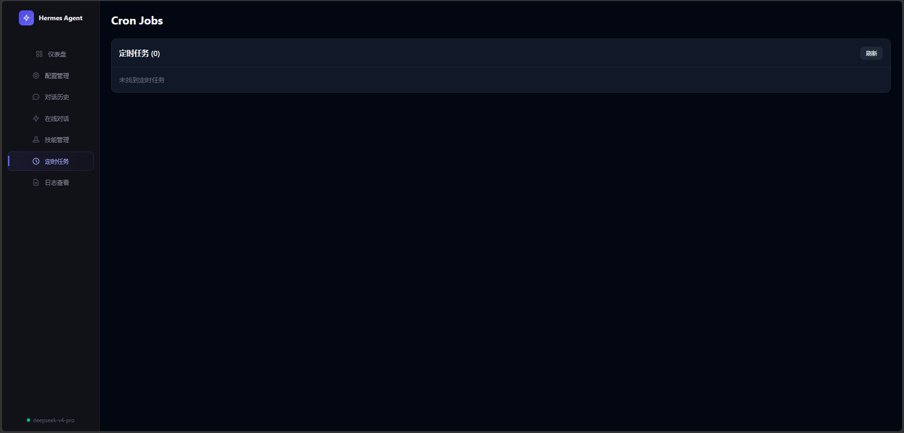
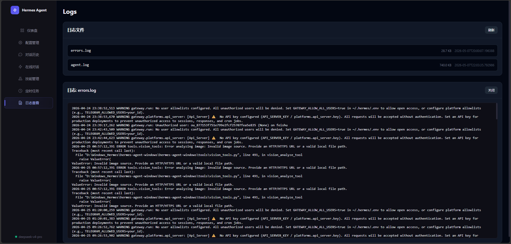
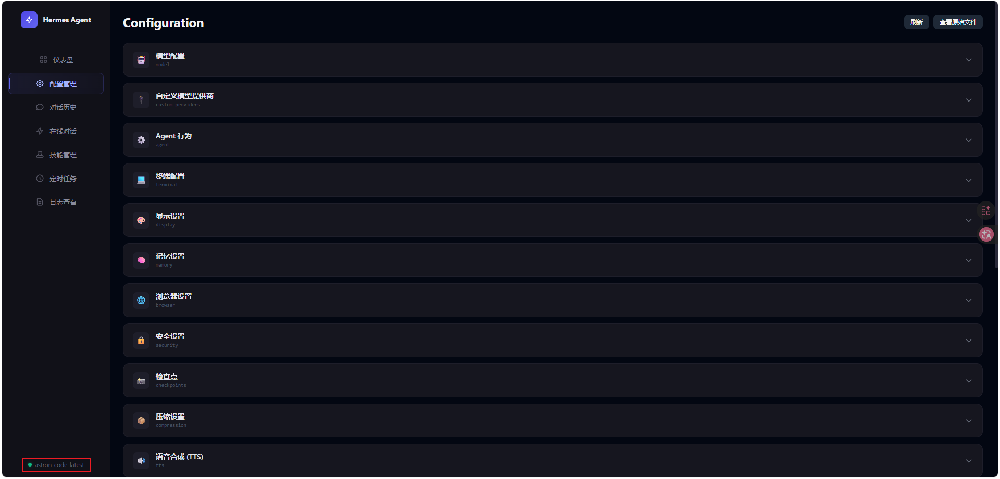

# Hermes Agent WebUI

Hermes Agent 的现代化 Web 管理面板，提供一站式配置管理、对话管理、技能管理等功能。

⚠️ **Windows 原生环境专用** — 本 WebUI 专为 Windows 环境下的 Hermes Agent 设计

## 功能详情

### 仪表盘

实时概览 Hermes Agent 运行状态，包括模型信息、对话统计、数据库状态、技能数量等。

<!-- screenshot: docs/screenshots/dashboard.png -->


### 配置管理

可视化编辑 Hermes 的 `config.yaml`，支持结构化卡片展示，每项配置独立展开/收起。支持文本、数字、布尔开关、下拉选择四种输入类型。自定义模型提供商（API Key 眼睛图标显示/隐藏 + 一键复制）。

<!-- screenshot: docs/screenshots/config.png -->


### 对话历史

浏览和搜索所有历史对话记录，支持按关键词过滤。每条记录展示模型名、消息数、Token 用量、费用估算等。点击展开可查看完整消息链，支持一键继续对话（自动填充到在线对话页面）。

**重命名**：每条记录底部有 ✏️ 重命名按钮，修改后双向同步到在线对话页面的「最近对话」列表。

<!-- screenshot: docs/screenshots/conversations.png -->


### 在线对话

与 Hermes Agent 实时聊天，页面左侧可快捷切换历史对话。

| 功能 | 说明 |
|------|------|
| **流式输出** | SSE 实时显示回复内容 |
| **Markdown 渲染** | 标题、代码块、表格、引用等完整支持 |
| **代码高亮** | highlight.js 自动语法着色，每个代码块带语言标签 + 复制按钮 |
| **文件上传** | 上传文件自动转换为路径，发送时拼入消息 |
| **对话切换** | 「最近对话」面板一键加载历史对话 |
| **继续对话** | 从历史页跳转后自动携带上下文 |
| **新建对话** | 点击后自动保存当前对话到历史记录 |

<!-- screenshot: docs/screenshots/chat.png -->


### 技能管理

浏览、搜索、编辑 Hermes Skills。支持分类筛选（按文件夹），查看 SKILL.md 全文，编辑并保存技能内容，创建新技能文件，以及从本地导入 `.md` 或 `.yaml` 文件。支持启用/禁用切换。

<!-- screenshot: docs/screenshots/skills.png -->


### 定时任务

查看 Hermes 的 Cron 定时任务列表，包括任务名称、执行时间、下次运行时间等。

<!-- screenshot: docs/screenshots/cron.png -->


### 日志查看

实时查看 Hermes Agent 运行日志，按文件列表展示，点击加载完整日志内容。

<!-- screenshot: docs/screenshots/logs.png -->


### 服务健康监控

实时检测 Hermes Gateway 连接状态，每 10 秒轮询一次。Gateway 断开或超时时右上角弹出全局 Toast 提醒，侧边栏底部显示当前状态（Gateway 断开 / 超时 / 运行中）。

<!-- screenshot: docs/screenshots/monitoring.png -->


## 技术栈

- **后端**: Python + FastAPI
- **前端**: Alpine.js + Tailwind CSS（纯静态，无构建步骤）
- **通信**: REST API + SSE 流式输出

## 快速开始

### 环境要求

- Python 3.10+
- Hermes Agent 已安装（可选，WebUI 可独立运行查看配置）

### 安装

```bash
# 克隆项目
git clone <repo-url>
cd hermes-webui

# 安装依赖
pip install -r requirements.txt
```

### 启动

**Windows:**
```bash
start.bat
```

**macOS / Linux:**
```bash
chmod +x start.sh
./start.sh
```

**或者直接:**
```bash
python app.py
# 或指定端口
WEBUI_PORT=8080 python app.py
```

访问 http://localhost:8686

### 配置

复制 `.env.example` 为 `.env`，按需修改：

```bash
# Hermes 数据目录（自动检测 ~/.hermes，也可手动指定）
HERMES_HOME=/path/to/.hermes

# WebUI 端口（默认 8686）
WEBUI_PORT=8686
```

## 项目结构

```
hermes-webui/
├── app.py              # FastAPI 主入口
├── requirements.txt    # Python 依赖
├── start.bat           # Windows 启动脚本
├── start.sh            # macOS/Linux 启动脚本
├── .env.example        # 环境变量示例
├── routers/            # API 路由模块
│   ├── config.py       # 配置管理
│   ├── conversations.py # 对话历史
│   ├── chat.py         # 在线对话
│   ├── skills.py       # 技能管理
│   ├── cron.py         # 定时任务
│   └── logs.py         # 日志查看
├── static/             # 前端静态文件
│   ├── index.html      # 主页面（单页应用）
│   └── vendor/         # 第三方库（marked.js, highlight.js）
└── workspace/          # 文件上传目录（运行时创建）
```

## 跨平台支持

- **Windows**: 直接运行 `start.bat` 或 `python app.py`
- **macOS / Linux**: 运行 `./start.sh` 或 `python app.py`
- **Hermes 目录**: 自动检测 `~/.hermes`，也可通过 `HERMES_HOME` 环境变量指定

## 许可证

MIT License
